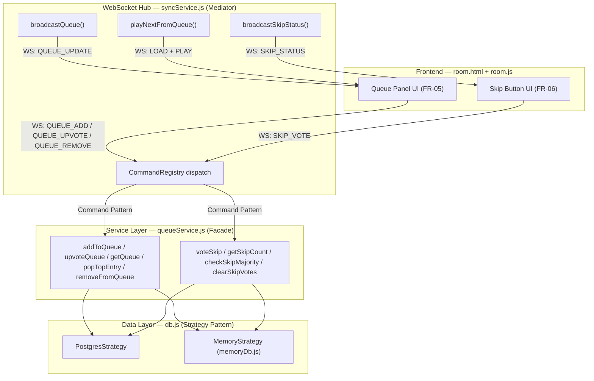
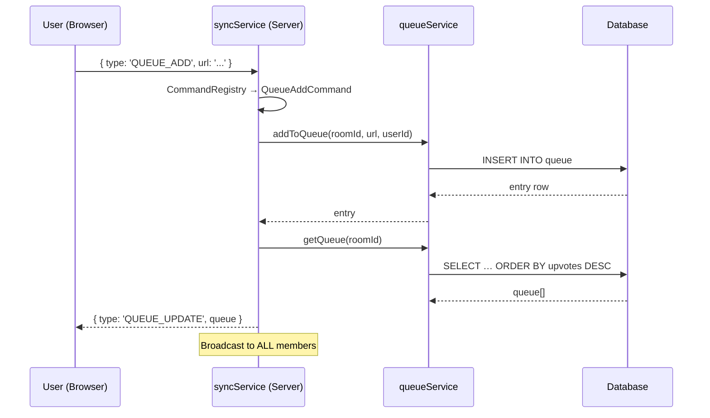
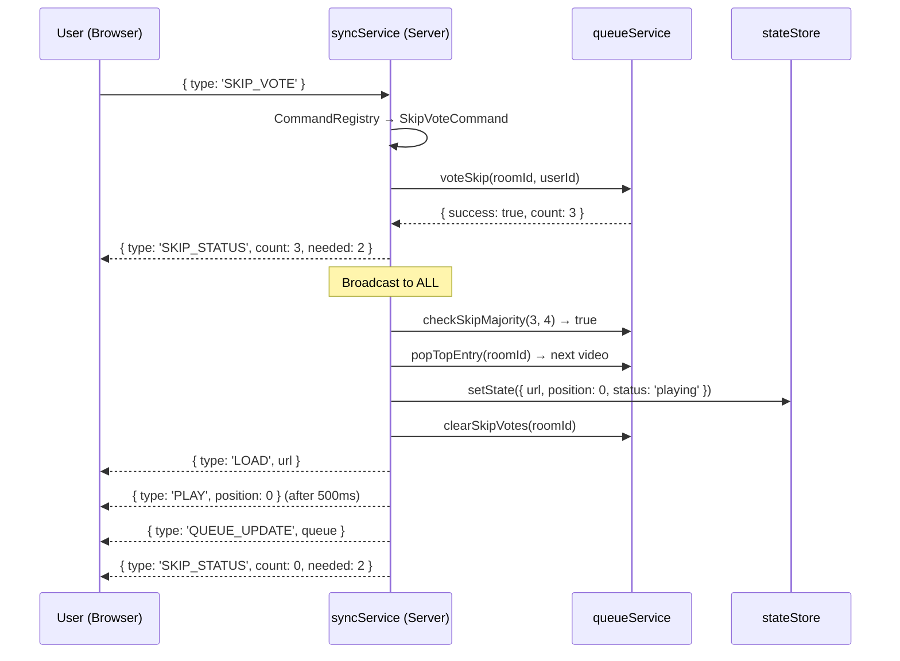

# FR-05 & FR-06 — Technical Implementation Walkthrough

> **Commit origin:** `fc49dc335ee` — *"added skip vote and vote-to-watch"*
> **Document source:** Latest codebase (post-refactor with Command, Observer, Strategy, and Facade patterns)

---

## 1. Requirements Recap

| ID | Name | Requirement |
|----|------|-------------|
| **FR-05** | Vote-to-Watch Queue | Members nominate video URLs; entries ranked by upvote count; top entry plays next automatically. |
| **FR-06** | Skip Vote | Majority-vote skip mechanic lets the group move past the current video without host intervention. |

---

## 2. Architectural Overview

Both features span **four layers** of the system, each wired together via design patterns:



---

## 3. Database Schema (Data Layer)

Three tables in [schema.sql](file:///Users/shubhampaliwal/Downloads/WatchParty/server/schema.sql) support these features:

### FR-05: Queue Tables

```sql
-- The queue itself: one row per nominated video
CREATE TABLE IF NOT EXISTS queue (
  id         SERIAL      PRIMARY KEY,
  room_id    TEXT        NOT NULL REFERENCES rooms(id) ON DELETE CASCADE,
  url        TEXT        NOT NULL,
  added_by   TEXT        NOT NULL DEFAULT 'unknown',
  upvotes    INT         NOT NULL DEFAULT 0,
  added_at   TIMESTAMPTZ NOT NULL DEFAULT NOW()
);
CREATE INDEX IF NOT EXISTS idx_queue_room ON queue(room_id, upvotes DESC);

-- Prevents duplicate upvotes: composite PK (queue_id, user_id)
CREATE TABLE IF NOT EXISTS queue_votes (
  queue_id   INT  NOT NULL REFERENCES queue(id) ON DELETE CASCADE,
  user_id    TEXT NOT NULL,
  PRIMARY KEY (queue_id, user_id)
);
```

### FR-06: Skip Votes Table

```sql
-- One row per user per room; composite PK prevents double-voting
CREATE TABLE IF NOT EXISTS skip_votes (
  room_id    TEXT NOT NULL REFERENCES rooms(id) ON DELETE CASCADE,
  user_id    TEXT NOT NULL,
  PRIMARY KEY (room_id, user_id)
);
```

> [!NOTE]
> The **Strategy Pattern** in [db.js](file:///Users/shubhampaliwal/Downloads/WatchParty/server/db.js) selects between `PostgresStrategy` (production) and `MemoryStrategy` ([memoryDb.js](file:///Users/shubhampaliwal/Downloads/WatchParty/server/memoryDb.js)) at startup. The in-memory strategy replicates all queue/skip SQL operations using Maps, enabling offline dev and testing without PostgreSQL.

---

## 4. Service Layer — `queueService.js`

[queueService.js](file:///Users/shubhampaliwal/Downloads/WatchParty/server/queueService.js) acts as a **Facade** — a single entry point that encapsulates all DB interactions for both features.

### FR-05 Functions

| Function | Purpose | SQL |
|----------|---------|-----|
| `addToQueue(roomId, url, userId)` | Insert a nomination | `INSERT INTO queue … RETURNING *` |
| `upvoteQueue(queueId, userId)` | +1 vote (idempotent — catches PG error `23505` for duplicate key) | `INSERT INTO queue_votes` then `UPDATE queue SET upvotes = upvotes + 1` |
| `getQueue(roomId)` | Fetch sorted queue | `SELECT … ORDER BY upvotes DESC, added_at ASC` |
| `popTopEntry(roomId)` | Atomically remove & return the top entry | `DELETE … WHERE id = (SELECT id … LIMIT 1) RETURNING *` |
| `removeFromQueue(queueId)` | Host-only delete | `DELETE FROM queue WHERE id = $1` |

### FR-06 Functions

| Function | Purpose |
|----------|---------|
| `voteSkip(roomId, userId)` | Insert a skip vote (idempotent via `23505` catch) → returns `{ success, count }` |
| `getSkipCount(roomId)` | `SELECT COUNT(*)` from `skip_votes` |
| `checkSkipMajority(skipCount, totalMembers)` | Pure function: `skipCount > totalMembers / 2` |
| `clearSkipVotes(roomId)` | `DELETE FROM skip_votes WHERE room_id = $1` — called on video change |

---

## 5. Command Pattern — WebSocket Message Handling

Each WebSocket message type is a discrete **Command** class extending [BaseCommand](file:///Users/shubhampaliwal/Downloads/WatchParty/server/commands/BaseCommand.js). The [CommandRegistry](file:///Users/shubhampaliwal/Downloads/WatchParty/server/commands/CommandRegistry.js) maps type strings to classes:

```
'QUEUE_ADD'    → QueueAddCommand
'QUEUE_UPVOTE' → QueueUpvoteCommand
'QUEUE_REMOVE' → QueueRemoveCommand
'SKIP_VOTE'    → SkipVoteCommand
'VIDEO_ENDED'  → VideoEndedCommand
```

### 5.1 Dispatch Flow in `syncService.js`

When a WebSocket message arrives in [syncService.js](file:///Users/shubhampaliwal/Downloads/WatchParty/server/syncService.js#L258-L302):

1. **Parse** JSON → look up `CommandRegistry.get(msg.type)`
2. **Build context** — an object bundling `roomId`, `userId`, `userRole`, and helper functions (`broadcastQueue`, `broadcastSkipStatus`, `playNextFromQueue`)
3. **Instantiate** → `new CommandClass(context)`
4. **Validate** → `cmd.validate(msg)` — returns `{ valid, error }`
5. **Execute** → `await cmd.execute(msg)`

### 5.2 FR-05 Commands

#### [QueueAddCommand](file:///Users/shubhampaliwal/Downloads/WatchParty/server/commands/QueueAddCommand.js)
- **validate:** URL must be non-empty (any member can add)
- **execute:** `addToQueue()` → `broadcastQueue()` → `emitEvent('queue:add')`

#### [QueueUpvoteCommand](file:///Users/shubhampaliwal/Downloads/WatchParty/server/commands/QueueUpvoteCommand.js)
- **validate:** `queueId` must parse to integer
- **execute:** `upvoteQueue()` → if not success, send ERROR back → else `broadcastQueue()`

#### [QueueRemoveCommand](file:///Users/shubhampaliwal/Downloads/WatchParty/server/commands/QueueRemoveCommand.js)
- **validate:** `isAuthorised()` check (host/co-host only) + valid `queueId`
- **execute:** `removeFromQueue()` → `broadcastQueue()`

#### [VideoEndedCommand](file:///Users/shubhampaliwal/Downloads/WatchParty/server/commands/VideoEndedCommand.js)
- **validate:** default (always valid)
- **execute:** only if `isAuthorised()` → calls `playNextFromQueue()`

### 5.3 FR-06 Command

#### [SkipVoteCommand](file:///Users/shubhampaliwal/Downloads/WatchParty/server/commands/SkipVoteCommand.js)
- **validate:** default (any member can vote)
- **execute flow:**
  1. `voteSkip(roomId, userId)` — persists vote
  2. If not success (already voted) → send ERROR
  3. `broadcastSkipStatus(count)` — tells all clients progress
  4. `checkSkipMajority(count, totalMembers)` — if true → `playNextFromQueue()`

---

## 6. Sync Service Helpers (Mediator Layer)

Three critical helpers in [syncService.js](file:///Users/shubhampaliwal/Downloads/WatchParty/server/syncService.js#L80-L133) orchestrate the real-time broadcast:

### `broadcastQueue(roomId)` — FR-05
```
getQueue(roomId) → roomManager.broadcast({ type: 'QUEUE_UPDATE', queue })
```
Called after every queue mutation (add, upvote, remove, auto-play).

### `broadcastSkipStatus(roomId, count)` — FR-06
```
totalMembers = roomManager.getMemberCount(roomId)
needed = Math.floor(totalMembers / 2) + 1
roomManager.broadcast({ type: 'SKIP_STATUS', count, needed })
```

### `playNextFromQueue(roomId)` — FR-05 + FR-06 intersection
This is the **auto-play bridge** between both features:

```
1. popTopEntry(roomId)          → atomically get + remove top entry
2. if null → broadcast QUEUE_EMPTY, return
3. normaliseUrl(entry.url)      → YouTube nocookie embed URL
4. setState(roomId, { url, position: 0, status: 'playing' })
5. clearSkipVotes(roomId)       → reset skip tally for new video
6. broadcast LOAD → setTimeout(500ms) → broadcast PLAY
7. broadcastQueue(roomId)       → refresh queue for all clients
8. broadcastSkipStatus(roomId, 0) → reset skip display
9. eventBus.emitRoom('queue:auto_play')
```

> [!IMPORTANT]
> `playNextFromQueue` is called from **two** triggers:
> - **FR-05:** `VideoEndedCommand` (host client signals video finished)
> - **FR-06:** `SkipVoteCommand` (when skip majority is reached)

---

## 7. Late-Join Queue Sync

When a new client sends `JOIN`, the [syncService handler](file:///Users/shubhampaliwal/Downloads/WatchParty/server/syncService.js#L232-L236) also sends the current queue:

```javascript
const queue = await getQueue(roomId);
roomManager.send(ws, { type: 'QUEUE_UPDATE', queue });
```

This ensures late joiners see the current vote-to-watch queue immediately.

---

## 8. Frontend Implementation

### 8.1 HTML Structure — [room.html](file:///Users/shubhampaliwal/Downloads/WatchParty/public/room.html)

**Queue Panel (FR-05)** — sidebar tab `📋 Queue` (lines 703–721):
- Input field + "+" button for nominations
- `#queue-list` container rendered dynamically
- Each item shows: rank, URL label, added-by, upvote button (▲ count), remove button (host only)

**Skip Section (FR-06)** — controls bar (lines 739–745):
- `⏭ Skip` button visible to **all** members
- `skip-progress` span showing `"X / Y votes"`

### 8.2 JavaScript — [room.js](file:///Users/shubhampaliwal/Downloads/WatchParty/public/js/room.js)

#### FR-05: Queue Actions (lines 938–958)

| Function | WebSocket Message |
|----------|-------------------|
| `addToQueue()` | `{ type: 'QUEUE_ADD', url }` |
| `upvoteQueue(queueId)` | `{ type: 'QUEUE_UPVOTE', queueId }` |
| `removeFromQueue(queueId)` | `{ type: 'QUEUE_REMOVE', queueId }` |

#### FR-05: Queue Rendering (lines 876–916)

`renderQueue(queue)` rebuilds the queue list from the server-sent array:
- Displays rank (#1, #2, …), a human-readable URL label, the nominator, and vote count
- Host/co-host see a **✕** remove button per entry
- All members see the **▲ upvote** button

#### FR-05: Video Ended → Auto-play (lines 672–676)

`onVideoEnded()` fires from the YouTube `STATE_CHANGE` event when state is `ENDED`:
```javascript
if (role === 'host' || role === 'co-host') {
  sendWs({ type: 'VIDEO_ENDED' });
}
```
Only the host sends this to avoid duplicate triggers.

#### FR-06: Skip Vote (lines 967–976)

```javascript
function voteSkip() { sendWs({ type: 'SKIP_VOTE' }); }

function updateSkipProgress(count, needed) {
  skipProgress.textContent = `${count} / ${needed} votes`;
}
```

#### Message Handler (lines 808–836)

```javascript
case 'QUEUE_UPDATE':  renderQueue(msg.queue ?? []);  break;
case 'SKIP_STATUS':   updateSkipProgress(msg.count, msg.needed);  break;
case 'QUEUE_EMPTY':   toast('Queue is empty — no next video.', 'info');  break;
```

When `LOAD` + `PLAY` arrive from `playNextFromQueue`, the existing playback handlers create/cue the YouTube player with the new video.

---

## 9. End-to-End Data Flow

### FR-05: User Nominates a Video



### FR-06: Skip Vote Reaches Majority



---

## 10. Design Patterns at Work

| Pattern | Where | Role in FR-05/FR-06 |
|---------|-------|---------------------|
| **Command** | `commands/QueueAdd*.js`, `SkipVoteCommand.js` | Each message type is a self-contained object with `validate()` + `execute()`. Adding new queue ops requires zero changes to `syncService.js`. |
| **Observer** | `eventBus.js` | Commands emit events (`queue:add`, `skip:vote`, `queue:auto_play`) for decoupled logging/analytics. |
| **Strategy** | `db.js` → `PostgresStrategy` / `MemoryStrategy` | Queue and skip SQL runs identically against Postgres or in-memory Maps. |
| **Mediator** | `syncService.js` | Coordinates between commands, services, RoomManager, and broadcasts. No command talks to another directly. |
| **Facade** | `queueService.js` | Hides all DB complexity behind clean async functions. Commands never write SQL. |

---

## 11. Test Coverage

### Unit Tests — [queue.test.js](file:///Users/shubhampaliwal/Downloads/WatchParty/tests/queue.test.js)

Tests `queueService.js` functions with a mocked DB layer:

| Suite | Tests |
|-------|-------|
| FR-05: `addToQueue` | Adds entry, verifies shape |
| FR-05: `getQueue` | Sorted by upvotes DESC |
| FR-05: `upvoteQueue` | Increments count; rejects duplicate from same user |
| FR-05: `popTopEntry` | Returns + removes top; returns null when empty |
| FR-05: `removeFromQueue` | Deletes specific entry |
| FR-06: `voteSkip` | Registers vote; rejects duplicate |
| FR-06: `checkSkipMajority` | True when >50%; false for edge cases (0/0, 0/1) |
| FR-06: `clearSkipVotes` | Clears all votes; allows re-voting |

### Integration Tests — [sync.test.js](file:///Users/shubhampaliwal/Downloads/WatchParty/tests/sync.test.js#L246-L336)

Spins up a real `ws.Server` and tests the full WebSocket flow:

| Suite | Tests |
|-------|-------|
| FR-05: Queue via WebSocket | `QUEUE_ADD` → both host+guest receive `QUEUE_UPDATE`; `QUEUE_UPVOTE` → updated count broadcast; non-host `QUEUE_REMOVE` → rejected with ERROR |
| FR-06: Skip Vote via WebSocket | `SKIP_VOTE` → `SKIP_STATUS` broadcast with correct `count` and `needed` |

---

## 12. File Summary

| File | Layer | FR |
|------|-------|----|
| [schema.sql](file:///Users/shubhampaliwal/Downloads/WatchParty/server/schema.sql) | Data | 05, 06 |
| [memoryDb.js](file:///Users/shubhampaliwal/Downloads/WatchParty/server/memoryDb.js) | Data | 05, 06 |
| [queueService.js](file:///Users/shubhampaliwal/Downloads/WatchParty/server/queueService.js) | Service | 05, 06 |
| [QueueAddCommand.js](file:///Users/shubhampaliwal/Downloads/WatchParty/server/commands/QueueAddCommand.js) | Command | 05 |
| [QueueUpvoteCommand.js](file:///Users/shubhampaliwal/Downloads/WatchParty/server/commands/QueueUpvoteCommand.js) | Command | 05 |
| [QueueRemoveCommand.js](file:///Users/shubhampaliwal/Downloads/WatchParty/server/commands/QueueRemoveCommand.js) | Command | 05 |
| [SkipVoteCommand.js](file:///Users/shubhampaliwal/Downloads/WatchParty/server/commands/SkipVoteCommand.js) | Command | 06 |
| [VideoEndedCommand.js](file:///Users/shubhampaliwal/Downloads/WatchParty/server/commands/VideoEndedCommand.js) | Command | 05 |
| [CommandRegistry.js](file:///Users/shubhampaliwal/Downloads/WatchParty/server/commands/CommandRegistry.js) | Command | 05, 06 |
| [syncService.js](file:///Users/shubhampaliwal/Downloads/WatchParty/server/syncService.js) | Mediator | 05, 06 |
| [room.html](file:///Users/shubhampaliwal/Downloads/WatchParty/public/room.html) | Frontend | 05, 06 |
| [room.js](file:///Users/shubhampaliwal/Downloads/WatchParty/public/js/room.js) | Frontend | 05, 06 |
| [queue.test.js](file:///Users/shubhampaliwal/Downloads/WatchParty/tests/queue.test.js) | Test | 05, 06 |
| [sync.test.js](file:///Users/shubhampaliwal/Downloads/WatchParty/tests/sync.test.js) | Test | 05, 06 |
