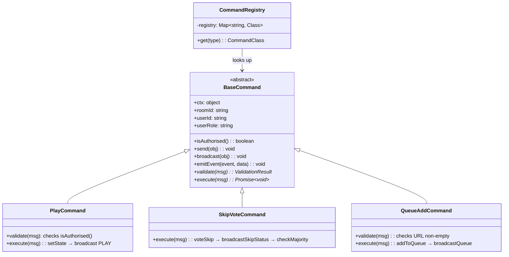
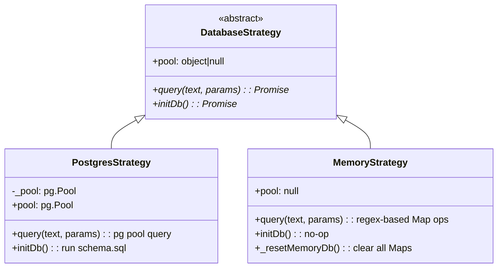
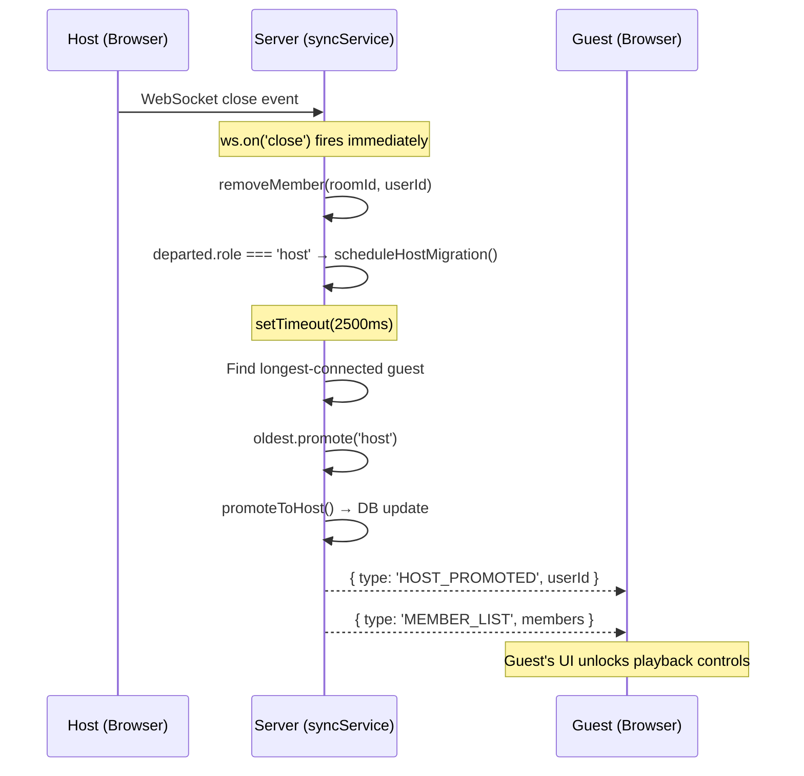

# Shubham's Contributions — Technical Walkthrough

> **Commit:** `d59481ee0b25` — *"added design patterns"*
> **Report sections:** 2.2.3 (ADR-03: Command Pattern), 2.2.4 (ADR-04: Strategy Pattern), 3.1.2 (Graceful Degradation Tactic)
> **Source:** Latest codebase

---

## 1. What You Built (Contribution Summary)

Per Table 12 of the report, Shubham's key contributions:

| Area | What | Files |
|------|------|-------|
| PostgreSQL schema | 5-table schema with queue/skip dedup | [schema.sql](file:///Users/shubhampaliwal/Downloads/WatchParty/server/schema.sql) |
| Strategy Pattern (DB abstraction) | Transparent Postgres ↔ Memory switching | [DatabaseStrategy.js](file:///Users/shubhampaliwal/Downloads/WatchParty/server/DatabaseStrategy.js), [db.js](file:///Users/shubhampaliwal/Downloads/WatchParty/server/db.js), [memoryDb.js](file:///Users/shubhampaliwal/Downloads/WatchParty/server/memoryDb.js) |
| queueService | Vote-to-Watch Queue + Skip Vote logic | [queueService.js](file:///Users/shubhampaliwal/Downloads/WatchParty/server/queueService.js) |
| Vote deduplication | Composite PK enforcement + error code catch | `queue_votes`, `skip_votes` tables |
| Memory fallback | Full in-memory DB for demo/dev | [memoryDb.js](file:///Users/shubhampaliwal/Downloads/WatchParty/server/memoryDb.js) |
| Security enhancements | Token validation, timing-safe compare | [roomService.js](file:///Users/shubhampaliwal/Downloads/WatchParty/server/roomService.js) |

The commit also co-introduced the **Command Pattern** refactoring (all 14 command classes + registry + base class).

---

## 2. ADR-03: Command Pattern for Message Dispatch (§2.2.3)

### 2.1 Why — The Problem

The initial `syncService.js` was a **300+ line if/else chain** handling 15+ WebSocket message types:

```javascript
// BEFORE (pseudocode of the monolith)
ws.on('message', (raw) => {
  const msg = JSON.parse(raw);
  if (msg.type === 'PLAY')       { /* 30 lines */ }
  else if (msg.type === 'PAUSE') { /* 25 lines */ }
  else if (msg.type === 'SEEK')  { /* 20 lines */ }
  else if (msg.type === 'LOAD')  { /* 40 lines */ }
  // ... 11 more types
});
```

**Problems:**
- **Open/Closed Principle violation** — adding a new message type = modifying the monolith
- **High regression risk** — one typo could break unrelated handlers
- **Untestable** — can't unit-test a single message type in isolation
- **NFR-08 violation** — fails maintainability requirements

### 2.2 How — The Solution

Three components replace the if/else chain:



#### Component 1: `BaseCommand` ([BaseCommand.js](file:///Users/shubhampaliwal/Downloads/WatchParty/server/commands/BaseCommand.js))

Abstract base class providing shared context and convenience methods:

```javascript
class BaseCommand {
  constructor(context) { this.ctx = context; }

  get roomId()   { return this.ctx.roomId; }
  get userId()   { return this.ctx.userId; }
  get userRole() { return this.ctx.userRole; }

  isAuthorised() {
    return this.userRole === 'host' || this.userRole === 'co-host';
  }

  // Abstract — subclasses override
  validate(msg) { return { valid: true }; }
  async execute(msg) { throw new Error('not implemented'); }
}
```

#### Component 2: 14 Concrete Commands

Each command is a single file, 15–40 lines, with `validate()` + `execute()`:

| Command | Message Type | FR | Auth Required? |
|---------|-------------|-----|----------------|
| [PlayCommand](file:///Users/shubhampaliwal/Downloads/WatchParty/server/commands/PlayCommand.js) | `PLAY` | FR-02 | ✅ host/co-host |
| [PauseCommand](file:///Users/shubhampaliwal/Downloads/WatchParty/server/commands/PauseCommand.js) | `PAUSE` | FR-02 | ✅ host/co-host |
| [SeekCommand](file:///Users/shubhampaliwal/Downloads/WatchParty/server/commands/SeekCommand.js) | `SEEK` | FR-02 | ✅ host/co-host |
| [LoadCommand](file:///Users/shubhampaliwal/Downloads/WatchParty/server/commands/LoadCommand.js) | `LOAD` | FR-02 | ✅ host/co-host |
| [GrantCohostCommand](file:///Users/shubhampaliwal/Downloads/WatchParty/server/commands/GrantCohostCommand.js) | `GRANT_COHOST` | FR-04 | ✅ host |
| [QueueAddCommand](file:///Users/shubhampaliwal/Downloads/WatchParty/server/commands/QueueAddCommand.js) | `QUEUE_ADD` | FR-05 | ❌ any member |
| [QueueUpvoteCommand](file:///Users/shubhampaliwal/Downloads/WatchParty/server/commands/QueueUpvoteCommand.js) | `QUEUE_UPVOTE` | FR-05 | ❌ any member |
| [QueueRemoveCommand](file:///Users/shubhampaliwal/Downloads/WatchParty/server/commands/QueueRemoveCommand.js) | `QUEUE_REMOVE` | FR-05 | ✅ host |
| [SkipVoteCommand](file:///Users/shubhampaliwal/Downloads/WatchParty/server/commands/SkipVoteCommand.js) | `SKIP_VOTE` | FR-06 | ❌ any member |
| [VideoEndedCommand](file:///Users/shubhampaliwal/Downloads/WatchParty/server/commands/VideoEndedCommand.js) | `VIDEO_ENDED` | FR-05 | ✅ host |
| [ChatMsgCommand](file:///Users/shubhampaliwal/Downloads/WatchParty/server/commands/ChatMsgCommand.js) | `CHAT_MSG` | FR-10 | ❌ any member |
| [ChatReactionCommand](file:///Users/shubhampaliwal/Downloads/WatchParty/server/commands/ChatReactionCommand.js) | `CHAT_REACTION` | FR-10 | ❌ any member |
| [SetNameCommand](file:///Users/shubhampaliwal/Downloads/WatchParty/server/commands/SetNameCommand.js) | `SET_NAME` | FR-08 | ❌ any member |
| [SyncCheckCommand](file:///Users/shubhampaliwal/Downloads/WatchParty/server/commands/SyncCheckCommand.js) | `SYNC_CHECK` | NFR-01 | ❌ any member |

#### Component 3: `CommandRegistry` ([CommandRegistry.js](file:///Users/shubhampaliwal/Downloads/WatchParty/server/commands/CommandRegistry.js))

A `Map<string, CommandClass>` — message type → constructor:

```javascript
const registry = new Map([
  ['PLAY',           PlayCommand],
  ['PAUSE',          PauseCommand],
  ['QUEUE_ADD',      QueueAddCommand],
  ['SKIP_VOTE',      SkipVoteCommand],
  // ... 10 more
]);
```

### 2.3 How Dispatch Works in `syncService.js`

The hub is now a **thin dispatcher** ([syncService.js L258–302](file:///Users/shubhampaliwal/Downloads/WatchParty/server/syncService.js#L258-L302)):

```javascript
// 1. Look up command class
const CommandClass = CommandRegistry.get(msg.type);
if (!CommandClass) { send ERROR; return; }

// 2. Build context with helpers
const context = { roomId, userId, userRole, ws, roomManager, chatService, eventBus,
  broadcastQueue, broadcastSkipStatus, playNextFromQueue, ... };

// 3. Instantiate, validate, execute
const cmd = new CommandClass(context);
const validation = cmd.validate(msg);
if (!validation.valid) { send ERROR; return; }
await cmd.execute(msg);
```

### 2.4 Concrete Example: PlayCommand

```javascript
class PlayCommand extends BaseCommand {
  validate(msg) {
    if (!this.isAuthorised())
      return { valid: false, error: 'Only host/co-host can control playback' };
    return { valid: true };
  }

  async execute(msg) {
    const position = parseFloat(msg.position ?? 0);
    await setState(this.roomId, { position, status: 'playing' });
    this.broadcast({ type: 'PLAY', position });
    this.emitEvent('playback:play', { position });
  }
}
```

### 2.5 Impact / Viva Talking Points

| Metric | Before | After |
|--------|--------|-------|
| `syncService.js` lines | ~550 | ~335 |
| Adding a new message type | Modify monolith + risk regression | 1 new file + 1 line in registry |
| Unit testability | Must mock entire WS hub | Test each command class in isolation |
| Open/Closed Principle | ❌ Violated | ✅ Satisfied |

> **Viva answer:** *"The Command Pattern was chosen over keeping the if/else chain because at 15+ message types the monolith violated the Open/Closed Principle. Each command is now independently testable. Adding a new feature like QUEUE_ADD required zero changes to syncService.js — just a new file and one registry line."*

---

## 3. ADR-04: Strategy Pattern for Database Abstraction (§2.2.4)

### 3.1 Why — The Problem

The original `db.js` had a **runtime boolean flag** checked on every query:

```javascript
// BEFORE — conditional on every single call
async function query(text, params) {
  if (useMemory) {
    return memoryQuery(text, params);  // in-memory simulation
  }
  return pool.query(text, params);     // PostgreSQL
}
```

**Problems:**
- Conditional logic on **every** query call (performance + readability)
- Violates Single Responsibility — `db.js` knew about both backends
- Adding a third backend (SQLite, MySQL) = modifying existing code

### 3.2 How — The Solution

Three-component Strategy Pattern:



#### The Interface: `DatabaseStrategy` ([DatabaseStrategy.js](file:///Users/shubhampaliwal/Downloads/WatchParty/server/DatabaseStrategy.js))

```javascript
class DatabaseStrategy {
  async query(text, params = []) {
    throw new Error(`${this.constructor.name}.query() not implemented`);
  }
  async initDb() {
    throw new Error(`${this.constructor.name}.initDb() not implemented`);
  }
  get pool() { return null; }
}
```

#### Concrete Strategy 1: `PostgresStrategy` (inside [db.js](file:///Users/shubhampaliwal/Downloads/WatchParty/server/db.js#L22-L55))

```javascript
class PostgresStrategy extends DatabaseStrategy {
  constructor(connectionString) {
    super();
    const { Pool } = require('pg');
    this._pool = new Pool({ connectionString, max: 10, ... });
  }

  async query(text, params = []) {
    return this._pool.query(text, params);  // Real SQL
  }

  async initDb() {
    const sql = fs.readFileSync('schema.sql', 'utf8');
    await this._pool.query(sql);
  }
}
```

#### Concrete Strategy 2: `MemoryStrategy` ([memoryDb.js](file:///Users/shubhampaliwal/Downloads/WatchParty/server/memoryDb.js))

Simulates SQL using JavaScript Maps + regex matching on query strings:

```javascript
class MemoryStrategy extends DatabaseStrategy {
  async query(text, params = []) {
    const sql = text.replace(/\s+/g, ' ').trim();

    if (/INSERT INTO queue/i.test(sql)) {
      const [room_id, url, added_by] = params;
      const entry = { id: ++queueSerial, room_id, url, added_by, upvotes: 0, ... };
      queue.set(entry.id, entry);
      return { rows: [entry], rowCount: 1 };
    }

    if (/INSERT INTO queue_votes/i.test(sql)) {
      const key = `${params[0]}:${params[1]}`;
      if (queueVotes.has(key)) {
        const err = new Error('duplicate key');
        err.code = '23505';  // Same error code as PostgreSQL!
        throw err;
      }
      queueVotes.set(key, true);
      return { rows: [], rowCount: 1 };
    }
    // ... 15+ more SQL pattern handlers for all 5 tables
  }
}
```

> [!IMPORTANT]
> The `MemoryStrategy` replicates PostgreSQL's unique constraint violation error code (`23505`) so that `queueService.js` duplicate-vote handling works identically against both backends.

#### Strategy Selection ([db.js L59–67](file:///Users/shubhampaliwal/Downloads/WatchParty/server/db.js#L59-L67))

Selected **once at startup** — zero conditionals after:

```javascript
let strategy;
try {
  strategy = new PostgresStrategy(process.env.WP_DATABASE_URL || DEFAULT_DATABASE_URL);
} catch (err) {
  strategy = require('./memoryDb');  // Fallback
}

// Callers use this — never know which backend is active
async function query(text, params) {
  return strategy.query(text, params);
}
```

#### Double-fallback in `initDb()`:

```javascript
async function initDb() {
  try {
    await strategy.initDb();  // Try Postgres schema creation
  } catch (err) {
    // Postgres failed at runtime → switch strategy entirely
    strategy = require('./memoryDb');
    await strategy.initDb();
  }
}
```

### 3.3 In-Memory Tables (5 tables mirrored)

| Map | SQL Table | Key Structure |
|-----|-----------|---------------|
| `rooms` | `rooms` | `id → { id, invite_token, created_at, ... }` |
| `roomMembers` | `room_members` | `"roomId:userId" → { role, display_name, ... }` |
| `queue` | `queue` | `id → { id, room_id, url, upvotes, ... }` |
| `queueVotes` | `queue_votes` | `"queueId:userId" → true` |
| `skipVotes` | `skip_votes` | `"roomId:userId" → true` |

### 3.4 Impact / Viva Talking Points

> **Viva answer:** *"The Strategy Pattern was chosen because the original code had a runtime boolean checked on every query. Now the strategy is selected once at startup. roomService.js and queueService.js call `query()` and are completely unaware of which backend is active. The MemoryStrategy even replicates PostgreSQL error code 23505 for duplicate key violations, so the vote deduplication in queueService works identically on both backends."*

> **Why not an ORM?** *"Sequelize/Prisma would be a heavy dependency for just 5 simple tables. The Strategy Pattern gives us the same decoupling with zero external dependencies for the fallback path."*

---

## 4. Architectural Tactic: Graceful Degradation (§3.1.2)

### 4.1 Why — The NFR Requirements

| NFR | Requirement | Challenge |
|-----|-------------|-----------|
| NFR-02 | 99% uptime during evaluation | External deps (Postgres, Redis) might be down |
| NFR-03 | Host dropout → guest promoted within 3s | Session must survive host disconnect |

The system must **never hard-fail** because one dependency is unavailable.

### 4.2 How — Three Degradation Layers

#### Layer 1: Database Fallback (Strategy Pattern)

```
Startup → try PostgresStrategy → fail? → switch to MemoryStrategy
Runtime initDb() → try schema creation → fail? → switch to MemoryStrategy
```

All callers (`roomService`, `queueService`) are unaware of the switch. The system is **fully functional** without PostgreSQL — it just loses persistence across restarts.

#### Layer 2: Redis Fallback (Singleton StateStore)

[stateStore.js](file:///Users/shubhampaliwal/Downloads/WatchParty/server/stateStore.js) implements a **dual-layer store**:

```
Write path:  memory Map → async Redis (fire-and-forget)
Read path:   memory Map → Redis fallback → rehydrate to memory
```

```javascript
// In stateStore.js — Redis connection is non-blocking
_connectRedis() {
  this.redis = new Redis({
    lazyConnect: true,
    maxRetriesPerRequest: 1,
    retryStrategy(times) {
      if (times > 2) return null;  // Stop retrying — memory-only mode
      return Math.min(times * 200, 1000);
    },
    connectTimeout: 3000,
  });

  this.redis.on('error', () => { this.redisAvailable = false; });
}

// Write — memory always, Redis optional
async setState(roomId, snapshot) {
  this.memStore.set(roomId, next);          // Always succeeds
  if (this.redisAvailable) {
    try { await this.redis.hset(...); }     // Fire-and-forget
    catch { /* Redis down — memory-only */ }
  }
}
```

> [!NOTE]
> Redis is **never on the critical path**. Reads always hit the in-memory Map first (~microseconds). Redis is only consulted on cache miss (e.g., after a server restart).

#### Layer 3: Host Migration (FR-07 / NFR-03)

When the host disconnects, [syncService.js](file:///Users/shubhampaliwal/Downloads/WatchParty/server/syncService.js#L137-L166) triggers automatic promotion:

```javascript
function scheduleHostMigration(roomId, _departedUserId) {
  const members = roomManager.getMembers(roomId);
  if (!members || members.size === 0) return;

  setTimeout(async () => {
    const current = roomManager.getMembers(roomId);
    if (!current || current.size === 0) return;

    // Still no host? Pick the longest-connected guest
    const hasHost = [...current.values()].some(m => m.role === 'host');
    if (hasHost) return;

    const oldest = [...current.values()].reduce((a, b) =>
      a.joinedAt < b.joinedAt ? a : b
    );

    oldest.promote('host');
    await promoteToHost(roomId, oldest.userId);  // DB update (best-effort)

    roomManager.send(oldest.ws, { type: 'HOST_PROMOTED', userId: oldest.userId });
    roomManager.broadcastMemberList(roomId);
  }, 2_500);  // 2.5s timer → within NFR-03's 3s requirement
}
```

**Flow:**



**Why 2.5 seconds?** Gives a brief window for the host to reconnect (e.g., page refresh) before promoting someone else, while staying within NFR-03's 3-second deadline.

### 4.3 Degradation Summary Table

| Dependency | Down? | System Behavior | Data Impact |
|------------|-------|----------------|-------------|
| PostgreSQL | ✅ Down | Switches to MemoryStrategy at startup | No persistence across restarts |
| Redis | ✅ Down | Memory-only state store | No crash recovery |
| Host user | ✅ Disconnected | Oldest guest promoted in 2.5s | Session continues uninterrupted |
| All three | ✅ All down | Still fully functional (demo mode) | Everything in-memory |

### 4.4 Viva Talking Points

> **Viva answer:** *"Graceful degradation means the system never hard-fails. The Strategy Pattern handles database fallback — if Postgres is down, MemoryStrategy activates transparently. The StateStore's dual-layer design means Redis is fire-and-forget — reads always hit the in-memory Map first. And host migration uses WebSocket's immediate close detection plus a 2.5-second timer to promote the longest-connected guest, meeting NFR-03's 3-second requirement."*

> **Why not just require Postgres?** *"For a prototype that needs to demo reliably, graceful degradation is essential. The evaluator shouldn't need to install Postgres and Redis just to run `npm start`. The system works out of the box with zero external dependencies."*

---

## 5. Architecture Comparison: Why Event-Driven? (§4.2.3 & §4.2.4)

### 5.1 NFR-01 Sync Latency Comparison (§4.2.3)

| Metric | Event-Driven (Ours) | Layered N-Tier |
|--------|---------------------|----------------|
| Message path | Client → WS → Command → `ws.send()` (1 hop) | Client → HTTP → Controller → Service → DB → SSE push (3+ hops) |
| State read latency | ~microseconds (in-memory Map) | ~5-10ms (DB query per request) |
| Broadcast | Direct `ws.send()` to all (push) | SSE or polling (overhead) |
| E2E latency | <50ms | 100-500ms |
| Meets NFR-01 (≤1s)? | ✅ With significant margin | ~Yes, tighter margin |

> **Why this matters:** The broadcast path (`RoomManager.broadcast()`) iterates the in-memory `rooms` Map and calls `ws.send()` directly — **zero database I/O on the critical path**. In a layered architecture, every PLAY command would need a DB write + a separate push notification = minimum 2 network round-trips.

### 5.2 NFR-03 Fault Tolerance Comparison (§4.2.4)

| Metric | Event-Driven (Ours) | Layered N-Tier |
|--------|---------------------|----------------|
| Disconnect detection | WebSocket `close` event — **immediate** | HTTP timeout or heartbeat polling — 10-30s |
| Migration trigger | 2.5s (configurable timer) | 30+ seconds |
| State continuity | In-memory Map — no interruption | DB re-query required |
| Meets NFR-03 (≤3s)? | ✅ Yes (2.5s, verified by test) | ❌ No |

> **Viva answer:** *"WebSocket's persistent connection gives us instant disconnect detection via the `close` event. In a layered HTTP architecture, you can't detect client disconnection until a timeout expires (10-30 seconds), making the 3-second migration target impossible without adding a separate WebSocket channel anyway — which defeats the purpose of a layered architecture."*

---

## 6. Integration Test Evidence

### Host Migration Test ([sync.test.js L340-369](file:///Users/shubhampaliwal/Downloads/WatchParty/tests/sync.test.js#L340-L369))

```javascript
test('guest is promoted within 3 s when host disconnects', async () => {
  // Host and guest join
  send(host,  { type: 'JOIN', roomId: rid, userId: 'h3', role: 'host' });
  send(guest, { type: 'JOIN', roomId: rid, userId: 'g4', role: 'guest' });

  host.close(); // Simulate disconnect

  // Guest receives HOST_PROMOTED within 3s
  const promoted = await Promise.race([
    drainUntil(guest, 'HOST_PROMOTED'),
    new Promise((_, reject) => setTimeout(() => reject('Timeout'), 3500)),
  ]);
  expect(promoted.type).toBe('HOST_PROMOTED');
}, 5000);
```

### Queue Service Tests ([queue.test.js](file:///Users/shubhampaliwal/Downloads/WatchParty/tests/queue.test.js))

- `addToQueue` — verifies entry shape
- `upvoteQueue` — increments count; rejects duplicate (error code `23505`)
- `popTopEntry` — returns+removes top; null when empty
- `voteSkip` — registers vote; rejects duplicate
- `checkSkipMajority` — true when >50%, false for edge cases
- `clearSkipVotes` — allows re-voting after clear

---

## 7. Quick-Reference: Viva Q&A

| Question | Key Points |
|----------|-----------|
| **Why Command Pattern?** | 300-line if/else violated Open/Closed. Now: 1 new file + 1 registry line for new features. syncService reduced from ~550 to ~335 lines. |
| **Why Strategy Pattern?** | Runtime boolean on every query → strategy selected once at startup. Zero conditionals in business logic. MemoryStrategy replicates PG error codes. |
| **Why not an ORM?** | Only 5 simple tables. Sequelize/Prisma would be heavy. Strategy gives same decoupling with zero deps for fallback. |
| **How does graceful degradation work?** | 3 layers: DB fallback (Strategy), Redis fallback (fire-and-forget), Host migration (2.5s timer). System works with ALL external deps down. |
| **Why Event-Driven over Layered?** | Sub-second sync needs push-based WS. Layered = DB round-trip + SSE = 100-500ms. WS close event enables instant host dropout detection (vs 10-30s HTTP timeout). |
| **How is host migration tested?** | Integration test with real WS server. Host `close()` → guest receives `HOST_PROMOTED` within 3.5s timeout. |
| **How is vote dedup enforced?** | Composite PK `(queue_id, user_id)` in SQL. PG throws error `23505`. MemoryStrategy throws same code. `queueService` catches it → returns `{ success: false }`. |
